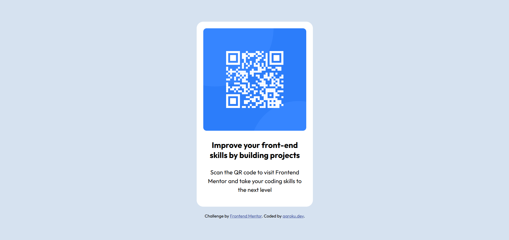

# Frontend Mentor - QR code component solution

This is a solution to the [QR code component challenge on Frontend Mentor](https://www.frontendmentor.io/challenges/qr-code-component-iux_sIO_H). Frontend Mentor challenges help you improve your coding skills by building realistic projects. 

## Table of contents

- [Overview](#overview)
  - [Screenshot](#screenshot)
  - [Links](#links)
- [My process](#my-process)
  - [Built with](#built-with)
- [Author](#author)

**Note: Delete this note and update the table of contents based on what sections you keep.**

## Overview

### Screenshot

### At desktop view

### At mobile view
 

### Links

- Solution URL: [Add solution URL here](https://your-solution-url.com)
- Live Site URL: [using Github Pages](https://qqroku.github.io/QR-Code/)

## My process

### Built with

- Semantic HTML5 markup
- CSS custom properties

## Author

- Github - [qqroku](https://qqroku.github.io/QR-Code/)
- Frontend Mentor - [@qqroku](http://frontendmentor.io/profile/qqroku)